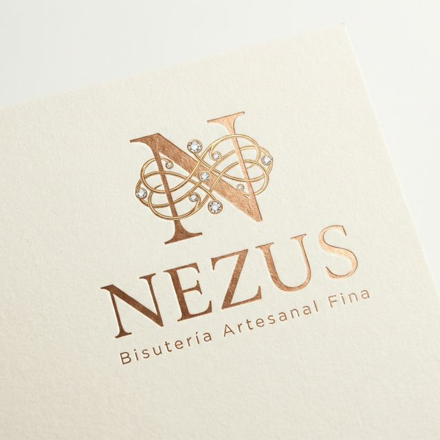

<p alig="center">
  
</p>

<h1 alig="center">Nezus Bisutería</h1>

<p alig="center">
  <strong>E-commerce de bisutería artesanal fina — Hecho en Perú 🇵🇪</strong>
</p>

<p alig="center">
  <a href="https://nezusbisuteria.com">🌐 Sitio Web</a> •
  <a href="#-características">✨ Características</a> •
  <a href="#-inicio-rápido">🚀 Inicio Rápido</a> •
  <a href="#-estructura-del-proyecto">📁 Estructura</a>
</p>

---

## 📋 Descripción

**Nezus Bisutería** es una tienda en línea premium dedicada a la venta de bisutería artesanal fina peruana. La plataforma ofrece una experiencia de compra inmersiva e interactiva con animaciones cinematográficas estilo Jacob & Co, un catálogo dinámico organizado por colecciones, sistema de carrito, checkout completo con métodos de pago peruanos, lookbook editorial, newsletter y un panel de administración integral.

## 🛠️ Stack Tecnológico

| Capa | Tecnología |
|---|---|
| **Framework** | [Next.js 16](https://nextjs.org/) (App Router) |
| **UI** | [React 19](https://react.dev/) + [TypeScript 5](https://www.typescriptlang.org/) |
| **Estilos** | [Tailwind CSS 4](https://tailwindcss.com/) + CSS personalizado |
| **Componentes UI** | [Radix UI](https://www.radix-ui.com/) + [shadcn/ui](https://ui.shadcn.com/) |
| **Animaciones** | [Framer Motion](https://www.framer.com/motion/) |
| **Base de Datos** | [Supabase](https://supabase.com/) (PostgreSQL + Auth + RLS) |
| **Imágenes** | [Cloudinary](https://cloudinary.com/) (CDN + Optimización) |
| **Emails** | [Nodemailer](https://nodemailer.com/) |
| **Formularios** | [React Hook Form](https://react-hook-form.com/) + [Zod](https://zod.dev/) |
| **Carrusel** | [Embla Carousel](https://www.embla-carousel.com/) |
| **Gráficos** | [Recharts](https://recharts.org/) (Panel Admin) |
| **Analítica** | [Vercel Analytics](https://vercel.com/analytics) |
| **Despliegue** | [Vercel](https://vercel.com/) |

## ✨ Características

### 🛍️ Tienda

- **Catálogo de productos** con categorías (Aretes, Collares, Pulseras) y colecciones temáticas (Resplandor Estival, Elegancia Nocturna, Geometría del Lujo, Colección Estelar, Edición Limitada)
- **Búsqueda avanzada** con filtros por precio, categoría, rating y disponibilidad
- **Vista rápida** de productos con modal interactivo
- **Carrito de compras** persistente con panel lateral deslizante
- **Lista de deseos** para usuarios registrados
- **Sistema de reseñas** y calificaciones con estrellas
- **Lookbook editorial 2026** con colecciones visuales temáticas

### 💳 Checkout

- Flujo de checkout completo con datos de envío
- Soporte para **Yape y Plin** (métodos de pago peruanos) con páginas dedicadas
- Aplicación de **cupones de descuento**
- Confirmación de pedido con notificación por email
- Envíos a todo Perú con selección de departamento/provincia/distrito

### 👤 Usuarios

- Autenticación con **Supabase Auth** (email/contraseña)
- Perfil de usuario con gestión de direcciones
- Historial de pedidos y seguimiento
- Registro y login con validación completa
- **Club Nezus** — programa de fidelidad con registro por suscripción

### 🔧 Panel de Administración (`/admin`)

- **Dashboard** con KPIs en tiempo real (ventas, pedidos, inventario)
- Gestión de **productos** (CRUD completo con upload de imágenes vía Cloudinary)
- Gestión de **órdenes** con actualización de estado
- Gestión de **cupones** de descuento
- Moderación de **reseñas**
- Control de **inventario** con alertas de stock bajo
- **Exportación** de datos a CSV

### 🎨 Experiencia de Usuario & Animaciones Inmersivas

- Diseño **responsive** optimizado para desktop, tablet y mobile
- **Animaciones inmersivas estilo Jacob & Co** con Framer Motion:
  - ✨ **Hero cinematográfico** — texto word-by-word reveal, Ken Burns zoom-out en video, botón CTA magnético con spring physics
  - 🎭 **Text Reveal** — animación de máscara por palabra en todos los títulos de sección
  - 📐 **AnimatedLine** — líneas decorativas que se extienden al scroll
  - 🧲 **MagneticButton** — botones CTA que siguen el cursor
  - 🃏 **Product Cards 3D** — entrada escalonada con hover float
  - 🌊 **CSS Premium** — gold shimmer, 3D tilt, smooth scroll
- Botón flotante de **WhatsApp** para atención directa
- Banner de **cookies** (RGPD)
- **Newsletter popup** para captura de leads
- Ticker de mensajes rotativos (envíos, pagos, contacto)
- SEO optimizado con meta tags, Open Graph y sitemap

## 📁 Estructura del Proyecto

```
nezus-website-main/
├── app/                          # App Router (páginas y API)
│   ├── admin/                    # Panel de administración
│   ├── api/                      # API Routes
│   │   ├── admin/                # Endpoints admin (productos, órdenes, cupones)
│   │   ├── auth/                 # Autenticación
│   │   ├── categories/           # Categorías
│   │   ├── checkout/             # Proceso de pago
│   │   ├── orders/               # Pedidos
│   │   ├── reviews/              # Reseñas
│   │   ├── search/               # Búsqueda y filtros
│   │   └── webhooks/             # Webhooks externos
│   ├── buscar/                   # Página de búsqueda
│   ├── checkout/                 # Checkout y confirmación
│   │   └── exito/                # Confirmación de compra
│   ├── login/                    # Inicio de sesión
│   ├── registro/                 # Registro de usuario
│   ├── nosotros/                 # Página "Sobre Nosotros"
│   ├── pago-yape/                # Página de pago Yape
│   ├── pago-plin/                # Página de pago Plin
│   ├── pedido-confirmado/        # Confirmación de pedido
│   ├── perfil/                   # Perfil de usuario
│   ├── producto/[slug]/          # Detalle de producto (dinámico)
│   ├── tienda/                   # Tienda y categorías
│   ├── politica-privacidad/      # Política de privacidad
│   ├── terminos/                 # Términos y condiciones
│   ├── layout.tsx                # Layout principal
│   ├── page.tsx                  # Página de inicio
│   └── globals.css               # Estilos globales + animaciones premium
├── components/                   # Componentes React
│   ├── ui/                       # Componentes base (shadcn/ui, ~61 componentes)
│   │   ├── text-reveal.tsx       # TextReveal, RevealWrapper, AnimatedLine
│   │   ├── magnetic-button.tsx   # Botón magnético con spring physics
│   │   └── ...                   # Botones, modales, inputs, etc.
│   ├── admin/                    # Componentes del panel admin
│   ├── header.tsx                # Navegación principal (mega-menu, búsqueda)
│   ├── hero.tsx                  # Hero cinematográfico con animaciones
│   ├── category-grid.tsx         # Grilla de categorías con 3D hover
│   ├── featured-products.tsx     # Productos destacados
│   ├── lookbook.tsx              # Lookbook editorial 2026
│   ├── about.tsx                 # Sección "Sobre Nosotros"
│   ├── promotions.tsx            # Sección de promociones
│   ├── testimonials.tsx          # Testimonios de clientes
│   ├── contact.tsx               # Formulario de contacto
│   ├── product-card.tsx          # Tarjeta de producto (3D staggered)
│   ├── product-details.tsx       # Detalle completo del producto
│   ├── cart-sheet.tsx            # Carrito lateral
│   ├── footer.tsx                # Pie de página + ticker de mensajes
│   ├── cookie-banner.tsx         # Banner de cookies
│   ├── quick-view-modal.tsx      # Vista rápida de producto
│   ├── search-bar.tsx            # Barra de búsqueda
│   ├── search-filters.tsx        # Filtros de búsqueda
│   └── ...                       # Otros componentes
├── lib/                          # Lógica compartida
│   ├── supabase/                 # Cliente y helpers de Supabase
│   ├── types.ts                  # Tipos TypeScript
│   ├── constants.ts              # Constantes (imágenes de categoría, etc.)
│   ├── auth-context.tsx          # Contexto de autenticación
│   ├── cart-context.tsx          # Contexto del carrito
│   ├── wishlist-context.tsx      # Contexto de lista de deseos
│   ├── search-context.tsx        # Contexto de búsqueda
│   ├── peru-locations.ts         # Departamentos/Provincias/Distritos
│   └── whatsapp.ts              # Utilidades de WhatsApp
├── hooks/                        # Custom hooks
│   ├── use-mobile.ts             # Detección de dispositivo
│   └── use-toast.ts              # Sistema de notificaciones
├── scripts/                      # Scripts de utilidad
│   ├── migrate-products.js       # Migración de productos
│   ├── upload-to-cloudinary.mjs  # Upload de imágenes
│   ├── create-admin.js           # Creación de usuarios admin
│   └── ...                       # Otros scripts
├── supabase/                     # Configuración de Supabase
│   ├── schema.sql                # Esquema completo de la DB
│   ├── seed_categories.sql       # Datos iniciales de categorías
│   ├── seed_products.sql         # Datos iniciales de productos
│   └── setup_admin.sql           # Configuración de roles admin
├── public/                       # Archivos estáticos
│   ├── images/                   # Imágenes de productos y lifestyle
│   │   └── lifestyle/            # Fotos lifestyle de productos
│   ├── nezus-premium-logo.png    # Logo principal
│   ├── robots.txt                # Configuración para bots
│   └── sitemap.xml               # Mapa del sitio
├── next.config.mjs               # Configuración de Next.js
├── tsconfig.json                 # Configuración de TypeScript
└── package.json                  # Dependencias y scripts
```

## 🚀 Inicio Rápido

### Prerrequisitos

- **Node.js** ≥ 18.x
- **npm**, **pnpm** o **bun**
- Cuenta de [Supabase](https://supabase.com/) (base de datos)
- Cuenta de [Cloudinary](https://cloudinary.com/) (imágenes) — opcional

### 1. Clonar el repositorio

```bash
git clone https://github.com/tu-usuario/nezus-website.git
cd nezus-website
```

### 2. Instalar dependencias

```bash
npm install
```

### 3. Configurar variables de entorno

Crea un archivo `.env.local` en la raíz del proyecto:

```env
# Supabase
NEXT_PUBLIC_SUPABASE_URL=https://tu-proyecto.supabase.co
NEXT_PUBLIC_SUPABASE_ANON_KEY=tu_anon_key
SUPABASE_SERVICE_ROLE_KEY=tu_service_role_key

# Cloudinary (opcional)
CLOUDINARY_CLOUD_NAME=tu_cloud_name
CLOUDINARY_API_KEY=tu_api_key
CLOUDINARY_API_SECRET=tu_api_secret

# Email (Nodemailer)
EMAIL_HOST=smtp.gmail.com
EMAIL_PORT=587
EMAIL_USER=tu_email@gmail.com
EMAIL_PASS=tu_app_password
```

### 4. Configurar la base de datos

Ejecuta los scripts SQL en tu proyecto de Supabase en este orden:

```sql
-- 1. Esquema de tablas
supabase/schema.sql

-- 2. Datos iniciales
supabase/seed_categories.sql
supabase/seed_products.sql

-- 3. Configuración de admin (opcional)
supabase/setup_admin.sql
```

### 5. Ejecutar en desarrollo

```bash
npm run dev
```

La aplicación estará disponible en [http://localhost:3000](http://localhost:3000).

## 📜 Scripts Disponibles

| Comando | Descripción |
|---|---|
| `npm run dev` | Servidor de desarrollo |
| `npm run build` | Build de producción |
| `npm run start` | Servidor de producción |
| `npm run lint` | Verificar código con ESLint |

## 🗄️ Base de Datos

El proyecto usa **Supabase** (PostgreSQL) con las siguientes tablas principales:

| Tabla | Descripción |
|---|---|
| `categories` | Categorías de productos |
| `products` | Catálogo de productos (imagen, lifestyle, precio, stock) |
| `orders` | Pedidos de clientes |
| `order_items` | Ítems de cada pedido |
| `order_tracking` | Seguimiento de envíos |
| `reviews` | Reseñas de productos |
| `review_votes` | Votos de utilidad en reseñas |
| `wishlists` | Lista de deseos |
| `profiles` | Perfiles de usuario |
| `addresses` | Direcciones de envío |
| `coupons` | Cupones de descuento |
| `coupon_usage` | Registro de uso de cupones |
| `inventory_logs` | Historial de inventario |
| `admin_roles` | Roles de administrador |
| `newsletter_subscribers` | Suscriptores del newsletter |

> Todas las tablas cuentan con **Row Level Security (RLS)** para proteger los datos.

## 🎬 Sistema de Animaciones

El proyecto implementa un sistema de animaciones inmersivas inspirado en marcas de lujo como **Jacob & Co**:

| Componente | Ubicación | Descripción |
|---|---|---|
| `TextReveal` | `components/ui/text-reveal.tsx` | Texto que aparece palabra por palabra con clip-mask |
| `RevealWrapper` | `components/ui/text-reveal.tsx` | Contenedor con reveal animado desde abajo |
| `AnimatedLine` | `components/ui/text-reveal.tsx` | Línea decorativa que se extiende al scroll |
| `MagneticButton` | `components/ui/magnetic-button.tsx` | Botón que sigue el cursor con spring physics |
| Hero cinematográfico | `components/hero.tsx` | Ken Burns zoom, word-by-word title reveal |
| Product Card 3D | `components/product-card.tsx` | Entrada escalonada + hover float |
| CSS Premium | `app/globals.css` | Gold shimmer, 3D tilt, smooth scroll |

## 🌐 Despliegue

El proyecto está optimizado para desplegarse en **Vercel**:

1. Conecta tu repositorio en [vercel.com](https://vercel.com)
2. Configura las variables de entorno en el dashboard de Vercel
3. Despliega automáticamente con cada push a `main`

## 📄 Licencia

Este proyecto es privado y de uso exclusivo de **Nezus Bisutería**.

---

<p align="center">
  Hecho con ❤️ en Perú por el equipo de <strong>Nezus</strong>
</p>
