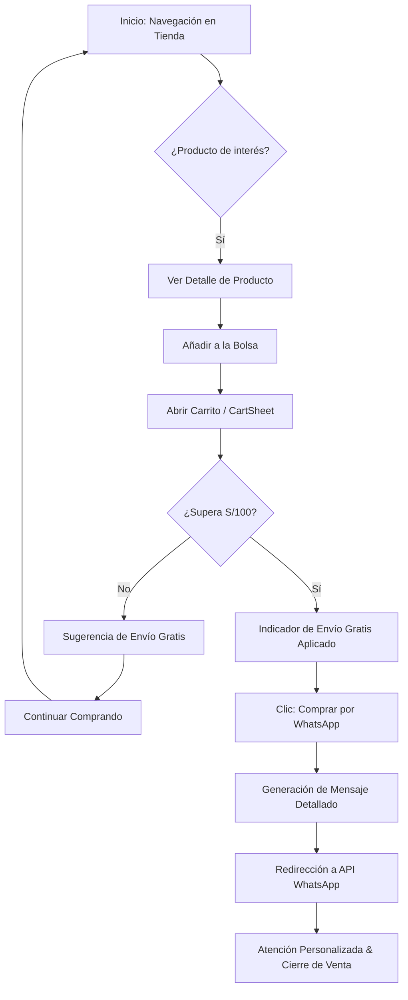
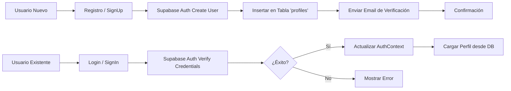
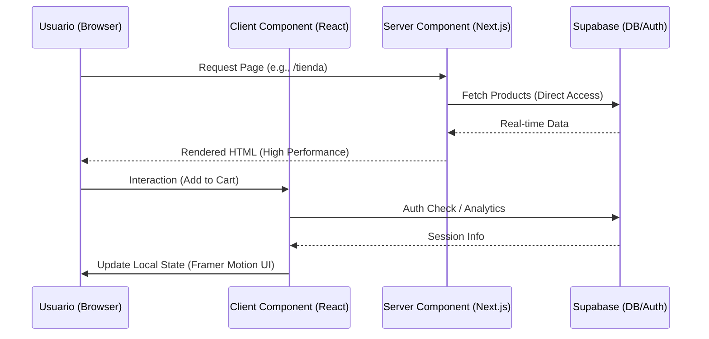

# 🔄 Flujos del Proyecto - Nezus
**Representación Visual de Procesos Clave**

---

## 1. Flujo de Compra (Checkout via WhatsApp)
Este flujo describe el camino desde que un usuario descubre un producto hasta que concreta la compra mediante una atención personalizada.

---

## 2. Flujo de Autenticación y Registro
Gestión de identidad de usuario utilizando Supabase Auth y sincronización de perfiles.

---

## 3. Flujo de Sincronización de Datos (System Flow)
Cómo fluye la información entre el servidor, la base de datos y la interfaz de usuario.

---

## 4. Estructura de Navegación (Site Map)
- **Home (`/`)**: Hero, Categorías, Productos Destacados, Nosotros, Testimonios.
- **Tienda (`/tienda`)**: Catálogo completo con filtros dinámicos.
- **Producto (`/producto/[id]`)**: Detalle, Galería, Opiniones.
- **Perfil (`/perfil`)**: Mis Pedidos, Favoritos, Ajustes.
- **Admin (`/admin`)**: Dashboard de gestión (Acceso Restringido).
